author: Comfort Desing Lab
summary: IoTとは
id: codelab-IoT-Learning
categories: IoT
environments: Web
status: Published
feedback link: https://docs.google.com/forms/d/e/1FAIpQLSczeKapm3sTn6f3aAAqKOqFQMMQFfpcQbVsjNLoiiEKo0th4Q/viewform?usp=sf_link

# IoT Learning Contents

## 全体概要

スマートシティで利用されているデジタル技術を理解しよう💡

IoTの概要から基礎・活用までを、活用されている事例を踏まえて紹介していきます。
スマートシティの実現による未来の社会を考えてみましょう！

### **目次**
1. 全体概要
1. IoTとは
1. IoTアプリケーション
1. IoTプラットフォーム
1. IoTとビッグデータ
1. データ分析
1. 参考文献

### **得られること**
- IoTに関する基本知識
- データの利活用に関する基本知識
- 未来の社会を考える社会的スキル

### **必要なモノ**
- インターネットに接続可能なPC または タブレット

## IoTとは

ここではIoTの概念について紹介します。

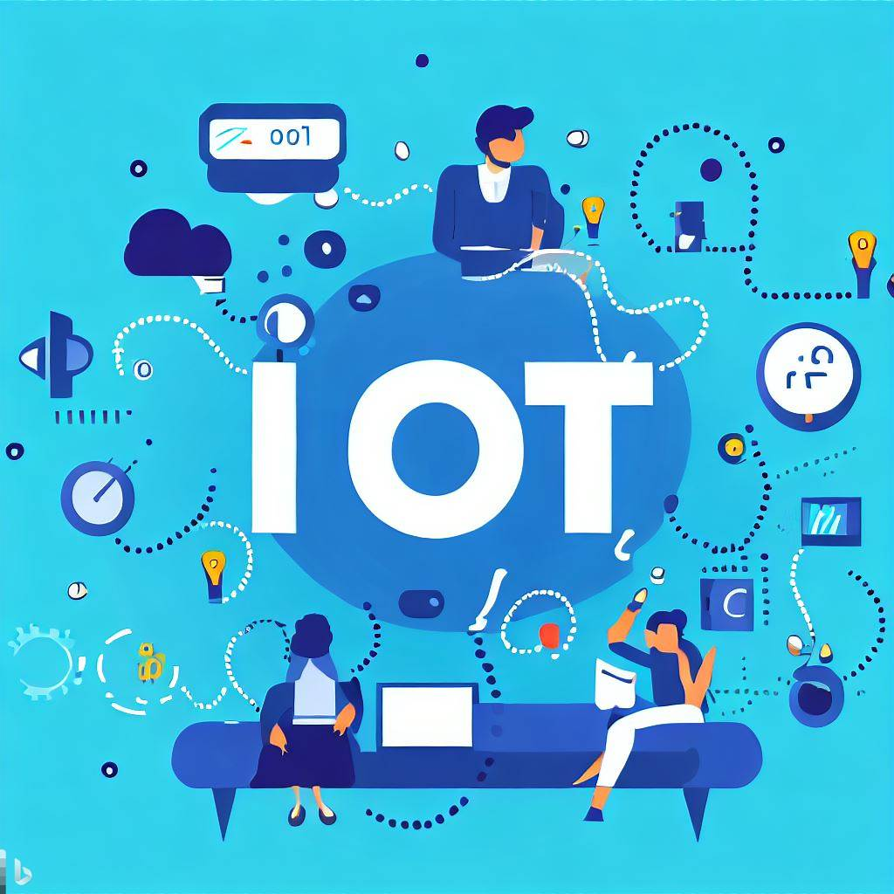

####  **IoTとは**
IoTとは **Internet of Things** の略で、**「モノのインターネット」** と訳されています。
身の回りのさまざまなモノが、インターネットを通じて互いに情報をやり取りする仕組みを指します。

異なるモノやデバイスがインターネットを通じてデータを収集・送信し、相互に情報をやり取りすることにより、日常生活や産業、都市などの様々な領域で、物体同士や物体と人とのコミュニケーションが実現されます。

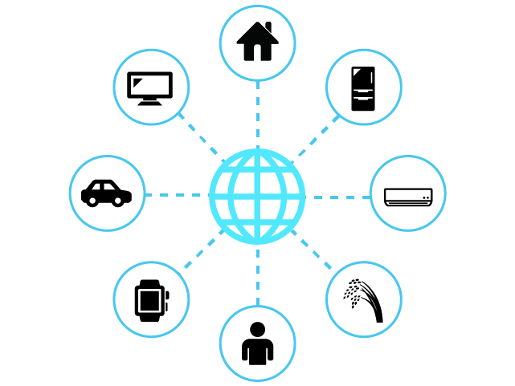

#### **IoTで実現できること**
IoTで実現できることは大きく分けて3つあります。
- IoTで**モノを操作**する
- IoTで**モノの状態を把握**する
- IoTで**モノ同士が通信**する

#### **IoTでモノを操作する**
IoT技術を活用すれば、インターネットを通じて離れた場所にあるモノを操作することができます。例えば、スマートフォンでの家電製品の操作や照明のON/OFFなどです。また工場などでも幅広く活用されており、外から工場の設備を動かす、現場に行かずに機器のメンテナンスを行う、といったことが実現できます。

#### **IoTでモノの状態を把握する**
センサで取得した情報をインターネット経由で受信することで、離れた場所にあるモノの状態を把握することができます。例えば、部屋の環境を知る、モノの動きを検知する、モノの現在位置を知る、モノの使用状況を知る、といった状態を知ることができます。先ほど紹介したモノを操作する機能と組み合わせれば、設備の異常な動きをリアルタイムに把握して、遠隔ですばやくメンテナンス対応することも可能です。

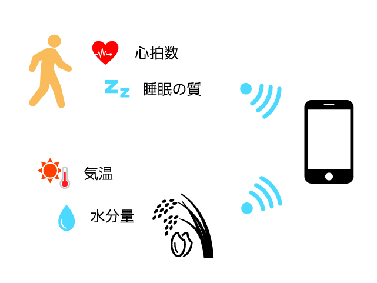

#### **IoTでモノ同士が通信する**
IoT技術では、インターネットを通じてモノ同士が通信することができます。人が介在しなくてもモノ同士が情報を交換し自動で動作してくれます。そのため、自動化を実現する上では欠かせない技術です。例えば、現在注目を集めている自動運転技術では、ほかの車や道路のさまざまな機器と通信して周辺状況を把握しつつ走行する技術が開発されています。

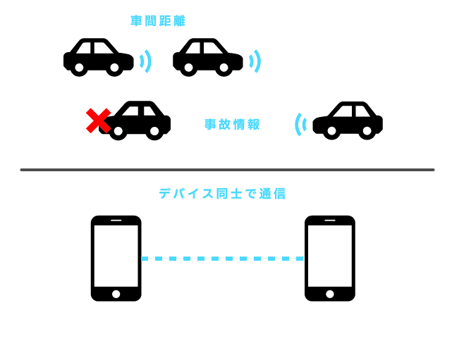

#### **IoTにおける５つのステップ**

これらの機能を実現するために、IoTは5つのステップを行なっています。

1. **計測**  
モノや環境からデータを収集するため、センサやデバイスが使用されています。これには温度センサ、湿度センサ、動きセンサなど様々な種類のセンサが含まれています。これらのセンサは、実世界の情報をデジタルデータに変換しています。

1. **収集**  
センサやデバイスが収集したデータは、インターネットを介して送信されています。無線通信や有線通信など、さまざまな方法でデータがデータベースにアップロードされています。

1. **蓄積**  
収集されたデータは、インターネット上のサーバーやデータベースに保存されています。ここでデータは整理・管理され、必要なときにアクセスできるようになります。

1. **解析**  
蓄積されたデータを利用して、解析や処理が行われます。データの分析を行うことで、データからパターンや特徴を見つけ出しています。

1. **活用**  
解析で得られた結果を基に、適切なアクションを起こし活用していきます。例えば、スマートホームで室温が高い場合にエアコンが自動的に作動する、交通システムで渋滞が予測された場合に別ルートが提案されるなどがあります。

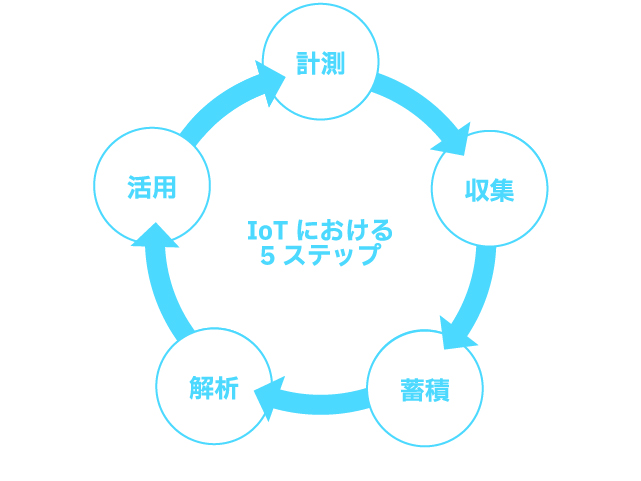

## IoTアプリケーション

ここではIoTアプリケーションについて紹介します。

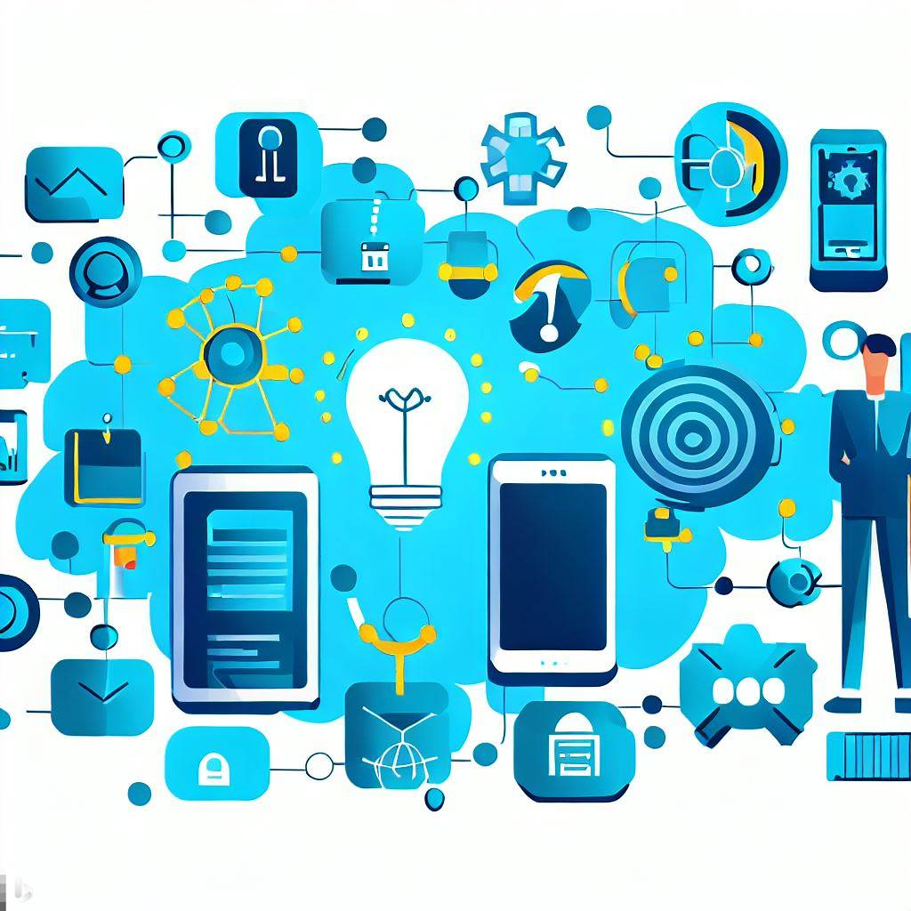

#### **IoTアプリケーションとは**
IoTアプリケーションは、物理的なデバイスやセンサー、ソフトウェア、およびその他の技術を組み合わせて、データを収集・交換するシステムを指します。これらのデバイスはインターネットを通じて接続され、リモートで制御や分析が可能です。

#### **IoTアプリケーションの例**
**スマートホーム**  
スマートサーモスタットや照明、セキュリティカメラなど、家庭内のデバイスをリモートで制御することができます。

<video id="VaJTeWzcF30"></video>

出典：[トヨタホーム 「もし、あなたがスマートハウスに住んだら・・・？」](https://youtu.be/VaJTeWzcF30?si=76aDiY39TSpFNTtW)

**ウェアラブルデバイス**  
スマートウォッチやフィットネストラッカーがこれに該当し、ユーザーの健康や活動をリアルタイムでモニタリングします。

<video id="LijTFPi2z4c"></video>

出典：[Fitbit Japan 「注目の新商品、Fitbit Sense 2 のご紹介」](https://youtu.be/LijTFPi2z4c?si=-Khccgvj_MPMFfNo)

**スマートシティ**  
交通管理、ゴミ収集、公共照明など、都市のインフラを最適化するためのIoTアプリケーション。

<video id="1ypXOivGqvU"></video>

出典：[内閣府 「スーパーシティ構想の実現に向けて」](https://youtu.be/1ypXOivGqvU?si=eDIE01c-_K4fplcZ)

**産業IoT（IIoT）**  
工場や製造施設での機械のモニタリングやメンテナンス、生産ラインの最適化など。

<video id="1u_LGpmuptc"></video>

出典：[KDDI 「KDDI IoTクラウド ～工場パッケージ～」](https://youtu.be/1u_LGpmuptc?si=LUij6lauAdjdb3O7)

**農業**  
土壌の湿度や気温をモニタリングして、最適な水や肥料の供給を自動化します。

<video id="LzDZhva3NHE"></video>

出典：[IIJ 「インターネットとつくる未来「水田の水管理IoT」編」](https://youtu.be/LzDZhva3NHE?si=nnZ5o2oeaSXIuyaO)

**医療**  
患者の健康状態をリモートでモニタリングするデバイスや、医薬品の在庫管理など。

<video id="MPQwGPLNeto"></video>

出典：[総務省 「介護におけるIoT活用事例紹介」](https://youtu.be/MPQwGPLNeto?si=Ao4yvXbRoYc_cemW)

#### **IoTの主な特徴**
1. **接続性**  
IoTデバイスは常にネットワークに接続されているため、リアルタイムでのデータ交換やリモート制御が可能です。

1. **自動化**  
センサーやアルゴリズムを使用して、特定の条件下で自動的に動作することができます。

1. **データ収集**  
多種多様なセンサーからのデータを収集し、クラウドやローカルのデータベースに保存することができます。

1. **リモートモニタリング**  
ユーザーはスマートフォンやコンピューターを使用して、デバイスの状態や動作をリアルタイムで確認することができます。

これらはIoTの実例の一部に過ぎません。IoT技術は急速に進化しており、さまざまな分野で新しいアプリケーションが開発されています。皆さんもアイデアの創出、プロトタイプ開発ができるように学習していきましょう！

## IoTプラットフォーム

ここではIoTプラットフォームについて紹介します。

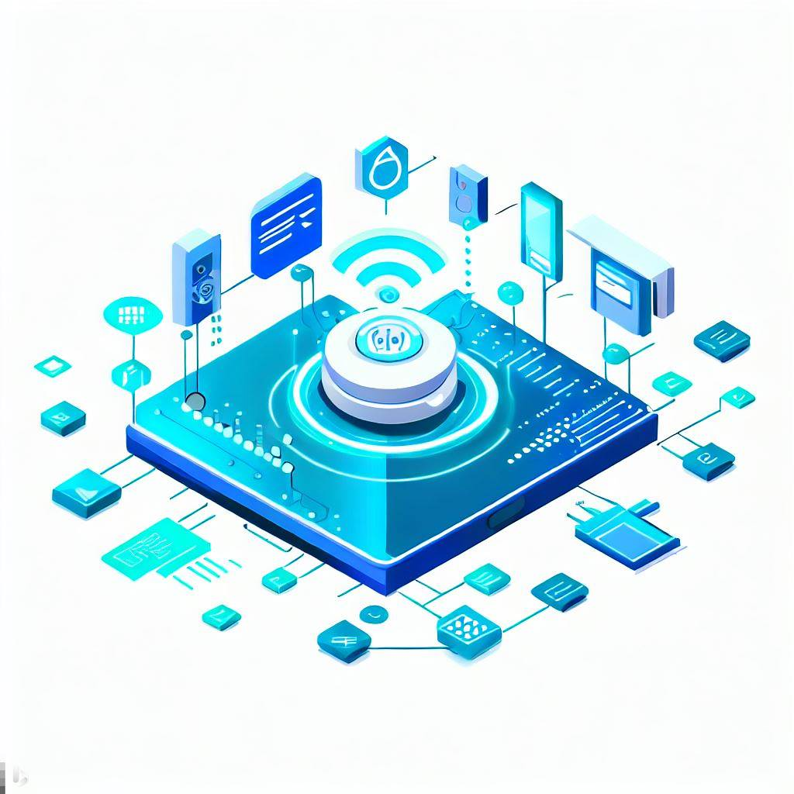

#### **IoTプラットフォームとは**
IoTプラットフォームは、IoTデバイスの接続、データの収集・解析、アプリケーションの開発など、IoTシステムを構築・管理するための基盤のことです。
これにより、異なるデバイスやアプリケーションが協調して動作し、データを共有・利用することができるようになります。

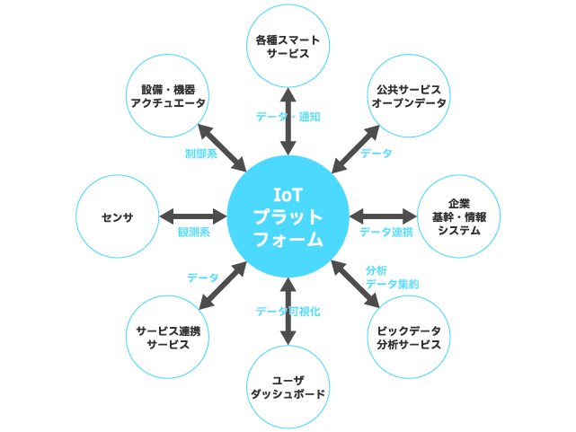

#### **IoTプラットフォームが備える基本機能**
1. **IoTデバイス接続と管理**  
IoTプラットフォームは、さまざまなデバイスやセンサーをインターネットに接続するためのツールを提供しています。
これにより、デバイスの登録、監視、遠隔制御などが可能になります。

1. **データ収集とストレージ**  
プラットフォームはデバイスからのデータを収集し、クラウド上のデータベースに格納しています。
ここでデータは整理・保管されることで、データの取得や解析を行えるようになります。

1. **データ解析と処理**  
IoTプラットフォームは、データ解析ツールを提供し、データから有効な情報を抽出する手助けをしています。
例えば、データのパターン、トレンド、異常値などを検出し、意味のある情報を生成しています。

1. **アプリケーション開発**  
IoTプラットフォームは、データを利用してアプリケーションを開発するためのツールやAPIを提供しています。
アプリケーションの開発者はこれを使用して、新しいサービスや機能を作成することができます。

- API（Application Programming Interface）とは：
 
ソフトウェアやアプリケーション同士が情報をやり取りするための技術のことです。
これを通じて、それぞれのソフトウェアはプラットフォームと連携し、データや機能を共有することができるようになります。

5. **セキュリティと認証**  
IoTプラットフォームは、データのセキュリティを保護するための仕組みを提供しています。
データの暗号化、アクセス制御、認証などが含まれます。

#### **オープンデータの活用**
多くの企業やプロバイダーが独自のIoTプラットフォームを提供しており、さまざまな用途に合わせたカスタマイズが可能です。また、オープンソースのIoTプラットフォームも存在し、開発者や企業が自由に活用できるプラットフォームもあります。

**プラットフォームの例**
1. **SORACOM**  
SORACOMは、IoT に特化したLTE/3Gモバイルデータ通信と、データを便利に、安全にお客様のシステムまで送り届ける付加サービスを提供するプラットフォームです。
また、SORACOMでは、パケット交換、帯域制御、顧客管理、課金管理といった機能を、クラウド上にソフトウェアで構築し、ユーザーコンソールもしくは、API で提供しています。
SORACOMプラットフォームは、大量のモノとつながる、IoTに必要な通信を提供することができます。

- サイトリンク:[SORACOM](https://soracom.jp/)

2. **RESAS**  
地域経済分析システム（RESAS：リーサス）は、地方創生の様々な取り組みを情報面から支援するために、経済産業省と内閣官房デジタル田園都市国家構想実現会議事務局が提供しています。
自治体職員の方や、地域の活性化に関心を持つ様々な分野の方によって、効果的な施策の立案・実行・検証のためなどに広く利用されています。

- サイトリンク：[RESAS](https://resas.go.jp/)

3. **データプラットフォームくれ**  
広島県呉市では、データを公開することにより、地域課題解決やイノベーション創発を促す取り組みである「データプラットフォームくれ」事業に取り組んでいます。本事業により提供されるデータの利用方法について紹介し、多くの方が呉市のデータを利活用いただくことを目的としています。

- サイトリンク：[データプラットフォームくれ](https://www.expolis.cloud/guides/opendata/t/kure/)

## IoTとビッグデータ

ここではIoTとビッグデータについて紹介します。

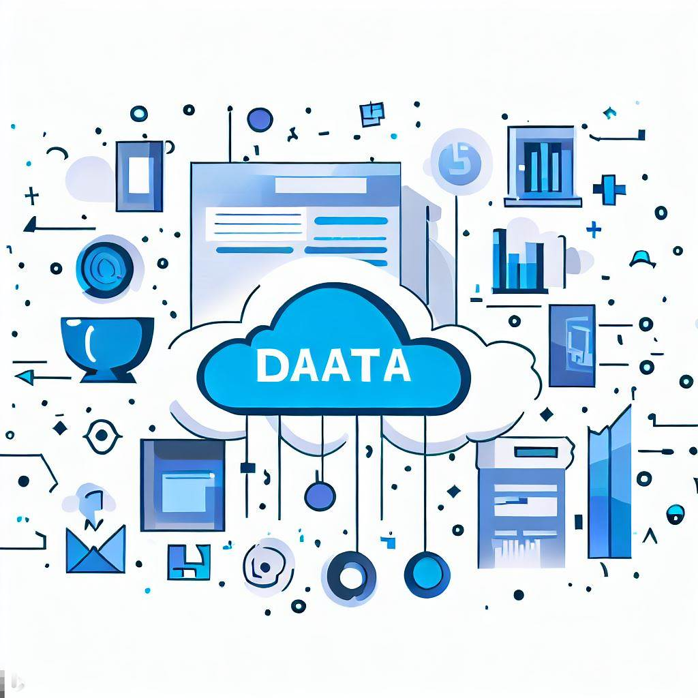

#### **IoTデバイスで収集可能なデータの種類**
IoTデバイスは、私たちの日常生活から様々なデータを収集します。
例えば、気温、湿度、位置情報、人の行動パターンなどがその一例です。
他にも基幹系の業務システムや、情報システムから抽出される情報、あるいはそれらのシステムの操作によって発生した情報など、様々なデバイス、センサからリアルタイムに発生する計測データなどがあります。

このように、**日々生成される多種多様なデータ群** のことを **ビッグデータ** と言います。

**ビックデータとは:**  
人間では全体を把握することが困難な巨大なデータ群のことです。
明確な定義は存在しませんが、一般的にはVolume（量）、Variety（種類）、Velocity（速度あるいは頻度）の **「3つのV」** を高いレベルで備えていることが特徴とされています。

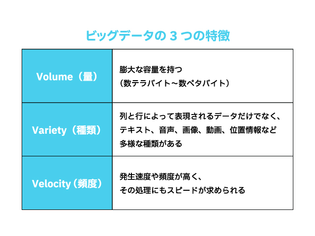

**収集可能なビッグデータの例**
- マルチメディアデータ
- ウェブサイトデータ
- センサデータ
- オペレーションデータ
- ログデータ
- オフィスデータ
- カスタマーデータ
- ソーシャルメディアデータ

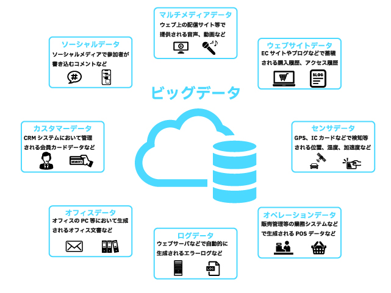

#### **IoTとビッグデータの関係性**
IoTとビッグデータの関係性は次のような要素が挙げられます。

1. **データの生成源**  
IoTデバイスは、様々な場所や状況でデータを生成します。センサーは温度、湿度、位置、動き、音、画像などのデータを収集します。これらのデータは、ビッグデータの基盤として活用されます。

1. **データの蓄積**  
IoTデバイスからのデータは、通常、クラウドベースのストレージやデータウェアハウスに収集されます。
これにより、大量のデータが中央集権的または分散型のデータリポジトリに保管され、ビッグデータが形成されます。

1. **データの多様性**  
IoTデバイスからのデータは、テキスト、画像、センサーデータなど、多くの異なるデータ形式を含みます。
ビッグデータは、これらの多様なデータ形式を取り扱うために設計されています。

1. **データの分析**  
ビッグデータの分析は、IoTデータを活用して洞察を得るための重要な手段です。
ビッグデータ分析は、パターン認識、異常検出、予測分析などの方法を使用して、IoTデータから価値を引き出します。

1. **リアルタイム対応**  
IoTデータは通常、リアルタイムで生成されます。
ビッグデータ分析プロセスにおいても速やかな対応が求められます。

これらの関係性から、IoTとビッグデータは相互に補完し合い、IoTデバイスからのデータがビッグデータとして集約・解析され、重要な洞察と価値を提供することができます。

#### **IoTデータの特徴**
IoTでは様々なデータを取り扱いますが、一般的にIoTデータの特徴として、次の事項が挙げられます。

- データは継続的に発生する
- 多種多様なデバイスやセンサから発生するデータが含まれる
- データの発生元となるのは、様々なメーカが作ったデバイス、センサ、その他の機器であ るため、規格、データフォーマット、通信プロトコルなどを合わせる必要あり
- 規格、データフォーマット、通信プロトコルが変化、変更になる可能性がある
- 多くのデバイス、センサから継続してデータが収集されるので、業務システムに比べ爆発的にデータが増えることになる
- データにノイズ(本来は必要としない付帯情報)が多く含まれている場合がある
- デバイスやセンサが持つ内部時刻のズレにより、時間についての誤差が発生する場合がある

## データ分析

ここではデータの分析について紹介します。

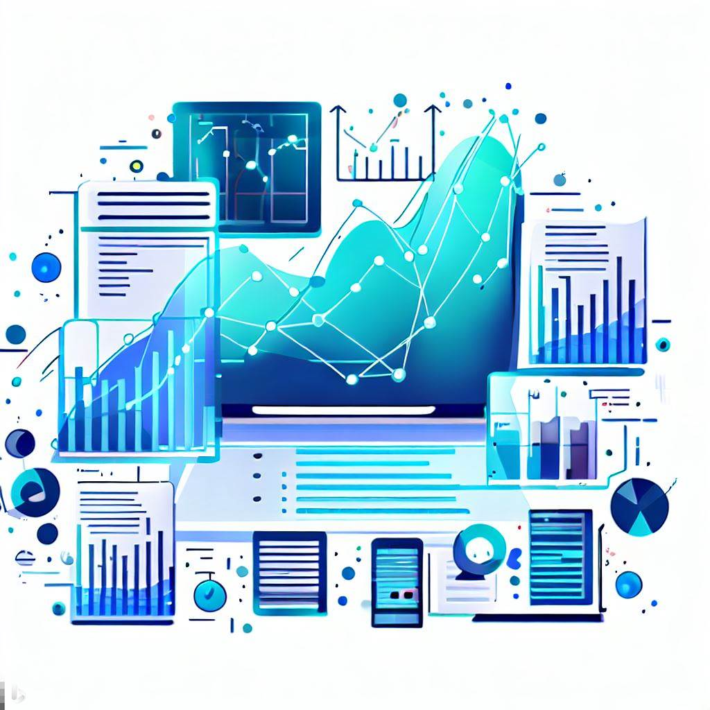

#### 

#### **ビッグデータを活用するには**
ビッグデータを活用する際には、**収集したデータをどのように分析し活用するのか** 目的を設定することが大切です。
設定した課題を解決するために必要となるデータを収集し、データをクレンジング（前処理）、蓄積、分析の流れで行います。

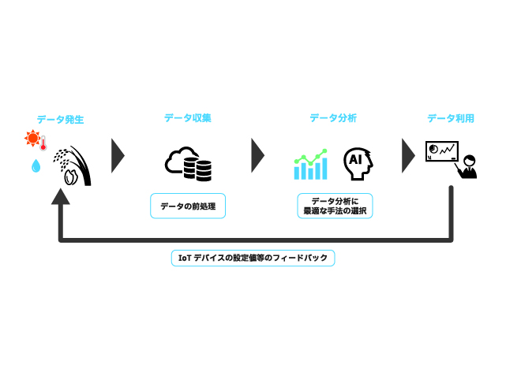

#### **データのクレンジング**
データのクレンジングは、データ分析において、データの品質を向上させるための重要なステップです。
データのをクレンジングする手順について紹介します。

1. **クリーニング**  
データクリーニングは、データセット内の不正確な、欠損している、または不要なデータを特定し、修正または削除すします。

- 欠損値の処理
- 外れ値の検出と処理
- 重複データの削除

2. **変換**  
データ変換は、データをモデルに適した形式に変換します。

- 特徴量抽出
- フィルタ処理
- 周波数変換

3. **結合**  
データ結合は、複数のデータソースから情報を結合します。
異なるデータセットからのデータをマージし、一貫性のあるデータセットを作成する際に使用されます。

4. **正規化**  
データの正規化は、データのスケールを調整し、異なる特徴量間の重み付けを均一化します。

- Zスコア正規化
- 最小-最大スケーリング

5. **分割**  
データセットを、トレーニングデータ、検証データ、テストデータの3つに分割します。

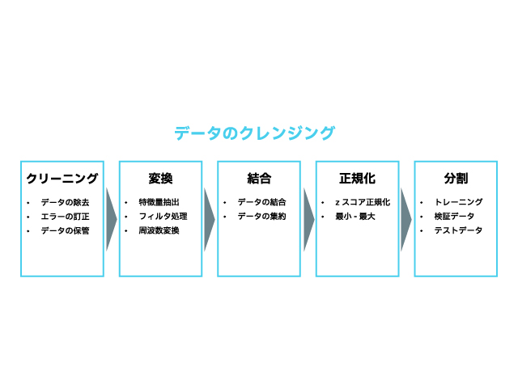

#### **分析手法の選択**
データ分析には大きく分けて **統計処理** と **機械学習** の2つがあります。

- **統計処理**  
統計処理は、データの特性やパターンを数値的に分析する方法です。
データから得られる情報を整理し、要約し、解釈するために広く使用されます。
分析結果の因果関係を人間が理解しやすい、**原理原則を探求する学術的手法** です。

- **機械学習**  
機械学習（Machine Learning）は、コンピュータにデータから学習させて、経験から知識を獲得して問題を解決する手法です。
データをもとにパターンやルールを学習し、その学習結果をもとに予測や判断を行う能力をコンピュータに与える方法です。
既知のデータから未知のデータを予測することを主な目的としており、機械学習は **実用性を重視したビジネス寄りの手法**  です。

ここでは、現在ビッグデータの解析に用いられている代表的な機械学習アルゴリズムを紹介します。

#### **機械学習アルゴリズムの例**
- **決定木**  
目的に対して関連の高い項目から順に分岐させ、ツリー構造で分析する手法です。
結果に影響する要因を分かりやすく可視化して、有益な情報を発掘することができます。
マーケティングにおいて特定の顧客属性に共通する特徴や傾向を見出すのに役立ちます。

- **ロジスティック回帰分析**  
いくつかの要因が引き起こす、「商品を買う／買わない」「イエス／ノー」「起こる／起こらない」といった答えが２つである事象の確率を説明・予測する統計手法です。
リピートの予測やサービス解約率・継続率の予測などに応用されています。

- **主成分分析**  
複数の変数を、より少ない変数に置き換えて統合し分析する手法です。
総合指標による評価が可能なため、アンケートなどの満足度調査やランキング調査に有用です。
また総合評価に一番影響を与える要素を洗い出して、マーケティングや製品開発に活かすこともできます。

- **K平均法**  
K平均法は、データ群を似た性質のグループに分けて分析する「クラスター分析」の一種です。
K平均法では、あらかじめ設定した「K」個に分類して分析を行います。
「高級志向」「コストパフォーマンス重視」「機能重視」など、分類したセグメントの分析を深めることで、それぞれのグループごとに最適化したマーケティング施策の展開が可能です。

- **アソシエーション分析**  
「ある行動を取る人は、この行動を取る傾向にある」というように、行動間の関連性を発掘する分析手法です。
「この商品を買った人は、こんな商品も買っています」といったECサイトのレコメンド機能のベースとなる技術です。
大量の商品を扱うECサイトにとっては、顧客体験（CX）の向上という観点でも欠かせない技術です。

#### **活用事例**
**1. データの活用による交通、雪の対策**  
気象データや徐排雪実施記録などのほかにごみ収集車などに搭載したセンサーから得られた路面情報などを利用し、路面状況を原因とした渋滞が発生しやすい地域を特定し、スポット的な除排雪を行いました。

|                |          | 
| -------------- | -------- | 
| **目的**           | 取得したデータを分析し、渋滞ポイントの特定を行い、スポット的な徐耕雪を実施 | 
| **利用したデータ** | 静的データ（除排雪実施記録、気象データなど）、センサデータ（現在の路面状況、加速度）、位置情報 | 
| **結果**           | 渋滞、交通機関の乱れの緩和 | 

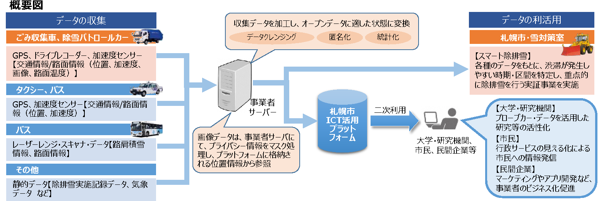
 
 

**2. ICTを活用した24時間リアルタイム赤潮監視体制の構築**  
赤潮の初期発生地域に自動昇降式観測機を設置すること、24時間ほぼリアルタイムで赤潮の監視が可能となり、緊急での赤潮の発生でも速やかに対応することが可能となった。

|                |          | 
| -------------- | -------- | 
| **目的**           | 赤潮初期発生地域に、２４時間ほぼリアルタイムで監視ができる自動昇降式観測機を設置し、HP上でだれでも閲覧可能とした。 | 
| **利用したデータ** | 通信機能付きカメラ（リアルタイム動画データ） | 
| **結果**           | 赤潮の監視が２４時間可能になり、緊急の赤潮の発生にも対応することが可能となった。 | 

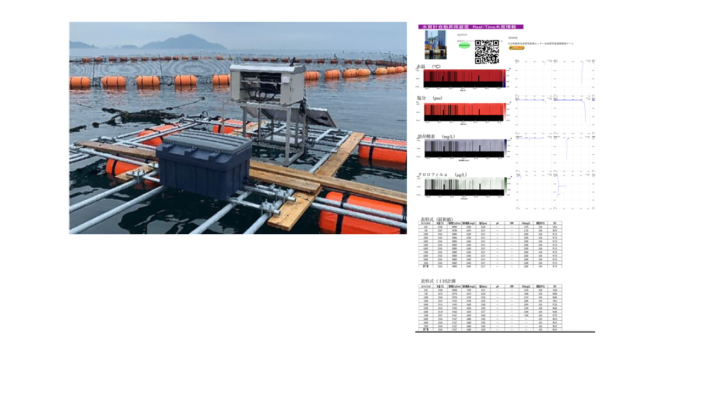

他の事例は事例集を見てみてください！

#### **IoTとAI**
AIとは、コンピュータがデータから学習し自動的に意思決定を行える能力を指します。
AIは大量のデータを分析し、パターンや関連性を発見し、予測や判断を行うことができます。

IoTで収集されるデータが、AIの学習と分析に活用されることで、新たな洞察や価値が生まれます。
IoTが提供するビッグデータは、AIの能力を引き出すための重要な情報源となり、私たちの生活やビジネスの向上に大いに寄与することが期待できます。
次の講義では、これらの概念を深く理解し、AIとビッグデータの具体的な応用について詳しく学びましょう。

## 参考文献

1. モバイルコンピューティング推進コンソーシアム監修　『IoT技術テキスト　ーMCPC IoTシステム技術検定 対応ー』 RIC 2016.10.28 

1. NECソリューションイノベータ　『ビッグデータとは？基礎知識と活用事例を解説』　https://www.nec-solutioninnovators.co.jp/sp/contents/column/20220318_big-data.html

1. NTT東日本　『ビッグデータとは？基礎知識やどう活用されるかを分かりやすく解説』　https://business.ntt-east.co.jp/content/cloudsolution/column-291.html

1. 総務省　『平成24年度版　情報通信白書　ビックデータとは何か』　https://www.soumu.go.jp/johotsusintokei/whitepaper/ja/h24/html/nc121410.html

1. 一般財団法人さっぽろ産業復興財団　『冬季プローブカーデータの収集・提供およびスマート除雪サービス』　https://www.soumu.go.jp/main_content/000563022.pdf

1. 農林水産研究指導センター　『ICTを活用した24時間リアルタイム赤潮監視体制の構築』　https://www.pref.oita.jp/uploaded/life/1053120_2835210_misc.pdf