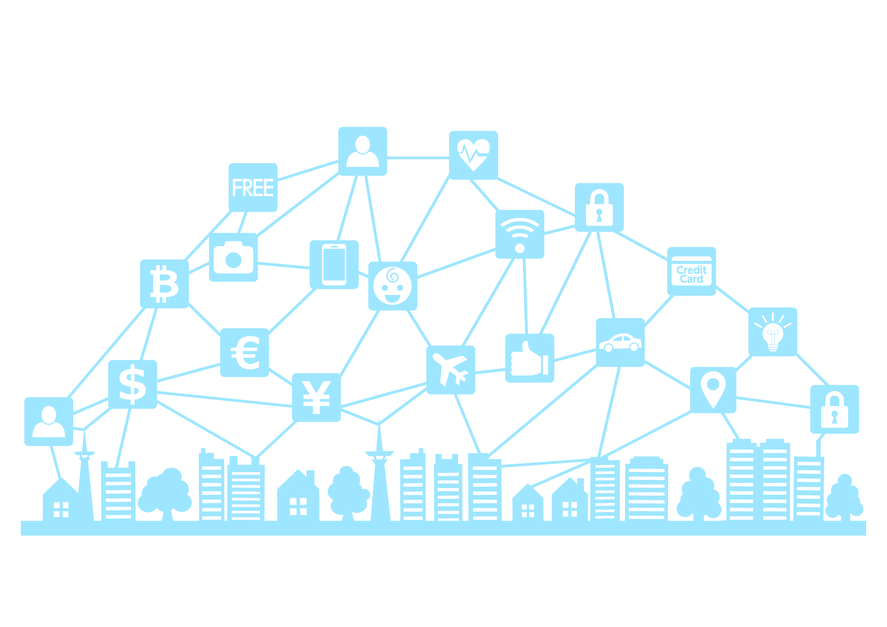
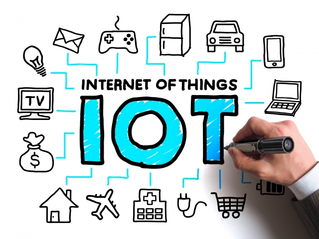
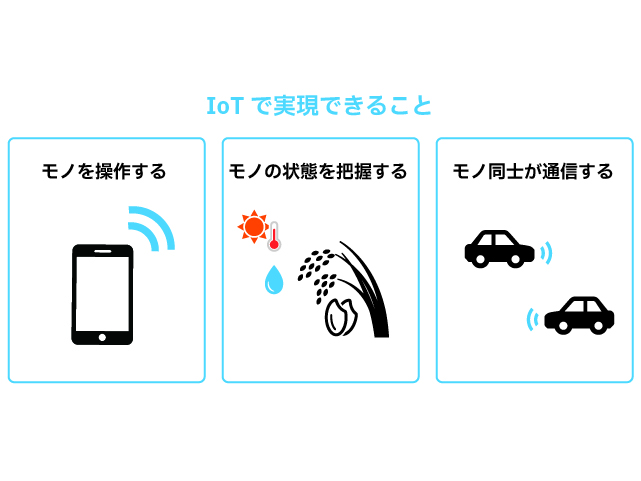
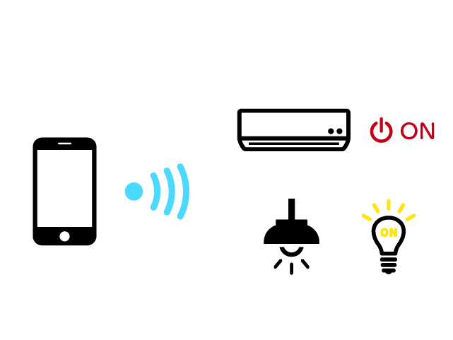
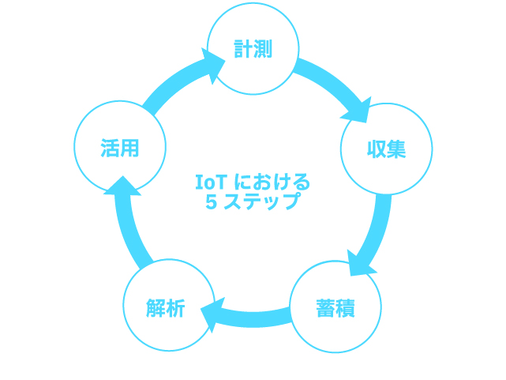

author: Comfort Desing Lab
summary: IoTとは
id: codelab-IoT-Learning
categories: IoT
environments: Web
status: Draft
feedback link: https://github.com/comfortdesignlab/steam-workshop-contents

# IoT Learning Contents

## 全体概要
Duration: 00:00:00

スマートシティで利用されているデジタル技術を理解しよう💡

※画像は仮置きです。後ほど差し替え予定

IoTの概要から基礎・活用までを、活用されている事例を踏まえて紹介していきます。
スマートシティの実現による未来の社会を考えてみましょう！

### 目次
1. 全体概要
1. IoTとは
1. IoTで実現できること
1. 活用事例の紹介
1. データを集める
1. IoTプラットフォーム
1. データ分析手法
1. 参考文献

### 得られること
- IoTに関する基本知識
- データの利活用に関する基本知識-
- 未来の社会を考える社会的スキル

### 必要なモノ
- インターネットに接続可能なPC または タブレット

## IoTとは
Duration: 00:05:00

ここではIoTの概念について紹介します。

※画像は仮置きです。後ほど差し替え予定

#### IoTとは
IoTとは **Internet of Things** の略で、**「モノのインターネット」** と訳されています。
身の回りのさまざまなモノが、インターネットを通じて互いに情報をやり取りする仕組みを指します。

異なる物体やデバイスがインターネットを通じてデータを収集・送信し、相互に情報をやり取りすることにより、日常生活や産業、都市などの様々な領域で、物体同士や物体と人とのコミュニケーションが実現されます。

#### 例えば...
家の中の冷蔵庫や照明、スマートフォン、自動車などが互いにデータを送受信し、連携することで便利な機能やサービスを提供することができます。

1. **スマートホーム**  
IoTを活用すると、スマートホームが実現できます。温度調整システムは、外出先からでも家の温度を調節できるようになります。センサーが部屋の状態をモニターし、適切な温度を保つように調整してくれます。

1. **健康モニタリング**  
IoTデバイスは健康管理にも役立ちます。心拍数や歩数を計測するウェアラブルデバイスは、日々の健康状態を把握しやすくしてくれます。医師との連携もしやすくなります。

1. **交通システム**  
スマートな交通システムもIoTの一例です。信号機や道路センサーがリアルタイムの交通情報を集め、渋滞回避のための経路案内を提供します。

## IoTで実現できること
Duration: 00:05:00

ここではIoTで実現できることを紹介します。

※何か表紙を挿入

#### 実現できること
IoTで実現できることは大きく分けて3つあります。
- IoTで**モノを操作**する
- IoTで**モノの状態を把握**する
- IoTで**モノ同士が通信**する

#### **IoTでモノを操作する**
IoT技術を活用すれば、インターネットを通じて離れた場所にあるモノを操作できます。代表例は、スマートフォンでの家電製品の操作や照明のON / OFFなどです。産業用途でも幅広く活用されており、外出先から工場の設備を動かす、現場に訪問せずに機器のメンテナンスを行う、といったことが実現できます。

#### **IoTでモノの状態を把握する**
センサーで取得した情報をインターネット経由で受信すれば、離れた場所にあるモノの状態を把握できます。例えば、遠隔地の環境を知る、モノの動きを検知する、モノの現在位置を知る、モノの使用状況を知る、といった用途でIoTが活用されています。先ほど紹介したモノを操作する機能と組み合わせれば、設備の異常な動きをリアルタイムに把握して、遠隔ですばやくメンテナンス対応することも可能です。

#### **IoTでモノ同士が通信する**
IoT技術では、インターネットを通じてモノ同士が通信することもできます。人が介在しなくてもモノ同士が情報交換して自動で動作してくれますので、自動化を実現する上では欠かせない技術です。例えば、現在注目を集めている自動運転技術では、ほかの車や道路のさまざまな機器と通信して周辺状況を把握しつつ走行する技術が開発されています。

#### **IoTにおける５つのステップ**

これらを実現するために、IoTはこれらによって構成されています。

1. **計測**  
物体や環境からデータを収集するためのセンサーやデバイスが使用されます。これには温度センサー、湿度センサー、動きセンサーなどが含まれます。これらのデバイスは、現実世界の情報をデジタルデータに変換します。

1. **収集**  
センサーやデバイスが収集したデータは、インターネットを介して送信されます。無線通信や有線通信など、さまざまな方法でデータがオンラインにアップロードされます。

1. **蓄積**  
収集されたデータは、クラウド上のサーバーやデータベースに保存されます。ここでデータは整理・管理され、必要なときにアクセスできるようになります。

1. **解析**  
保存されたデータは、解析や処理が行われます。この段階でデータからパターンやトレンドが見つかるか、特定の情報が抽出されます。

1. **活用**  
データ解析の結果に基づいて、適切なアクションが実行されます。例えば、スマートホームで温度が高い場合にエアコンが自動的に作動する、交通システムで渋滞が予測された場合に別ルートが提案されるなどがあります。

## 活用事例の紹介
Duration: 00:05:00

ここではIoT技術の活用事例を紹介します。

※何か表紙を挿入

### 〇〇の課題解決

こちらは...

※馬場くん担当

## IoTデータの活用
Duration: 00:05:00

ここではIoTデータの活用について紹介します。

※何か表紙を挿入

#### **IoTシステムにおけるデータの流れ**
IoTシステムを活用する際には、**「収集したデータをどのように分析し活用するのか」** を考えることが重要です。
IoTシステムにおいてはデータが継続的に増加し続けるため、データを収集・管理するにはコストがかかります。
コストに見合った効果が得られないシステムは、維持そのものが困難になるということは、IoTシステムにおいても変わりません。
そのためには、データを収集、蓄積するだけでなく、効率よく活用して新しい価値を創出する必要があります。
効率よく低コストなデータ運用を可能にするIoTシステムを実現するためには、目的に合致したデータの見極めと収集方法や、必要なデータの流れをシステムワイドに見渡せることが重要となります。

IoTで扱うデータの基本的なライフサイクルは、データの発生、収集、蓄積、整形、集約、分析、利用のフェーズにより成り立ちます。また、分析結果をIoTデバイスにフィードバックして活用する場合もあります。

#### **IoTデータの特徴**

IoTデバイスは、私たちの日常生活から様々なデータを収集します。例えば、気温、湿度、位置情報、人の行動パターンなどがその一例です。
他にも基幹系の業務システムや、情報システムから抽出される情報、あるいはそれらのシステムの操作によって発生した情報など、オープンデータのようなWeb上のデータだけでなく、様々なデバイス、センサからリアルタイムに発生する計測データなどがあります。IoTシステムは、このような様々なデータをリアルタイムに使用、もしくは蓄積して活用するなど、「可視化」「予測/分析」、「通知/制御」といった活用手段により高い価値を創出します。

IoTでは様々なデータを取り扱いますが、一般的にIoTデータの特徴として、次の事項が挙げられます。

- データは継続的に発生する
- 多種多様なデバイスやセンサから発生するデータが含まれる
- データの発生元となるのは、様々なメーカが作ったデバイス、センサ、その他の機器であ るため、規格、データフォーマット、通信プロトコルなどを合わせる必要あり
- 規格、データフォーマット、通信プロトコルが変化、変更になる可能性がある
- 多くのデバイス、センサから継続してデータが収集されるので、業務システムに比べ爆発的にデータが増えることになる
- データにノイズ(本来は必要としない付帯情報)が多く含まれている場合がある
- デバイスやセンサが持つ内部時刻のズレにより、時間についての誤差が発生する場合がある

#### **収集データの種類**

IoTシステムで収集できるビックデータの例を紹介します。

**ビックデータとは:** 
ICTの進展により生成・収集・蓄積等が可能・容易になる多種多量のデータのこと。
これらのデータを活用することにより、異変の察知や近未来の予測等を通じて、利用者個々のニーズに即したサービスの提供、営業運営の効率化や新産業の創出が期待できます。

**ビックデータの例**
- マルチメディアデータ
- ウェブサイトデータ
- センサデータ
- オペレーションデータ
- ログデータ
- オフィスデータ
- カスタマーデータ
- ソーシャルメディアデータ

## IoTプラットフォーム
Duration: 00:05:00

ここではIoTプラットフォームについて紹介します。

※何か表紙を挿入

#### **IoTプラットフォームとは**
IoTプラットフォームとは、ネットワークに接続されたIoTデバイスにより収集した、多種多様なデータを活用するためのシステム基盤のことを指します。
IoTにおける基本的なデータの流れは、センシングデータを取得して、それをクラウドなどのサーバに送り、そこでデータの格納、 値判定、分析などを行って、その結果に応じて通知などを行います。

※ここにイメージ画像が入ります。

#### **IoTプラットフォームが備える基本機能**
1. **アプリケーション・サービス連携**  
ユーザにデータの閲覧環境を提供するだけでなく、業務システムや外部サービスと連携する機能が求められています。
そこで、IoTプラットフォームでは、IoTで扱うデータとその他の外部システムや業務システムとの相互接続を可能にするために、必要なデータを取得できるAPIが提供されています。

1. **デバイス管理**  
センサやゲートウェイなどの機器の個体管理、構成管理、ソフトウェアアップデート、デバイスモニタリングなど、機器とクラウドとの接続情報の管理が必要となります。センサから収集するデータの属性情報、例えば、デバイスの名称や型式、シリアル番号、設置場所、管理者などをIoTプラットフォームで管理します。IoTデータの分析においては時系列と同様に場所の情報が重要になることが多いため、設置場所の情報も重要となります。

1. **データ管理**  
ToTプラットフォームが提供するデータ理機能では、センサデータのような非定型な機造を持つ大規模データを収集・格納・管理し、配信・可視化・分析する機能を提供しています。

1. **ユーザ管理**  
ユーザには、IoTプラットフォームのIoTサービスを直接利用する場合と、IoTサービスを活用して自分たちの顧客であるユーザに対して、通知したり、データをグラフ化して見せたり、サマリデータを渡す場合とが考えられます。

1. **セキュリティ管理**  
セキュリティはシステム全体で捉える必要があります。クラウド側に関しては、ほとんどのリスクは従来のITシステムのセキュリティ対策と同等になると考えられます。一方、センサやゲートウェイ側におけるセキュリティ対策については、機器の盗難、乗っ取り、詐称、データ汚染攻撃、バッテリー浪費攻撃といったIoT特有のリスクが想定されます。

#### **オープンデータの活用**
データからより多くの価値を引き出すためには、収集したデータだけでなく、公開されているオープンデータをうまく組み合わせることが重要です。
オープンデータとは、無償で自由に使えて再利用もでき、かつ誰でも再配布できるようなデー夕のことです。

**プラットフォームの例**
1. **RESAS**  
テキスト

1. **データプラットフォームくれ**  
テキスト

## データ分析手法
Duration: 00:05:00

ここではデータ分析手法について紹介します。

※何か表紙を挿入

#### **データ分析手順**
テキスト

1. **データの受付け**  
正しいデバイスからデータを受け取るようにデータ受け取り部に接続するデバイスやセンサやゲートウェイは正しい接続元であることを認証することが必要があります。

1. **データの加工**  
データ受付時にデータ加工する場合、データ利用時に加工する場合があります。
データ加工は通常はデータ利用側の分析ツールで行うのが一般的ですが、汎用的加工処理であればデータ提供用のAPIに加工の仕組みを組み込んでおくと利用者の負担軽減につながります。

1. **データの保管**  
増加し続ける大量の時系列データをどのように管理するのかを 工夫することが必要です。

1. **データのリアルタイム処理**  
途切れなく発生するデータをストリームデータといい、本データを継続的に処理することをストリーム処理と呼びます。

#### 統計処理と機械学習
データ解析には **統計処理** と **機械学習** があります。

**統計処理**
既知のデータの特性を説明することを主な目的としており、データの背景 にある現象の数理モデルが明確であるため、分析結果の因果関係を人間が理解しやすい、**原理原則を探求する学術的手法** です。

**機械学習**
既知のデータから未知のデータを予測することを主な目的としており、分析結果の因果関係はブラックボックスになり、適切な数理モデルの推定が難しい現象に適応できます。機械学習は **実用性を重視したビジネス寄りの手法**  です。

## 参考文献

