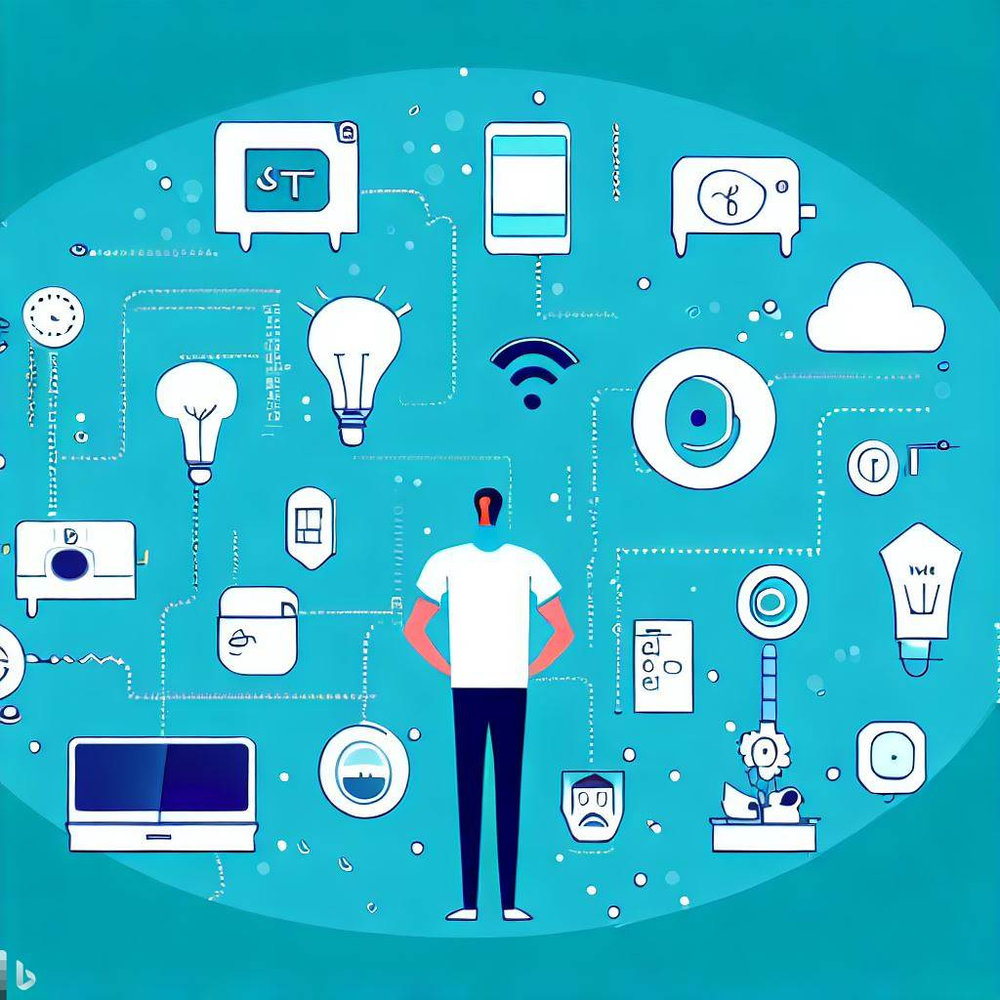
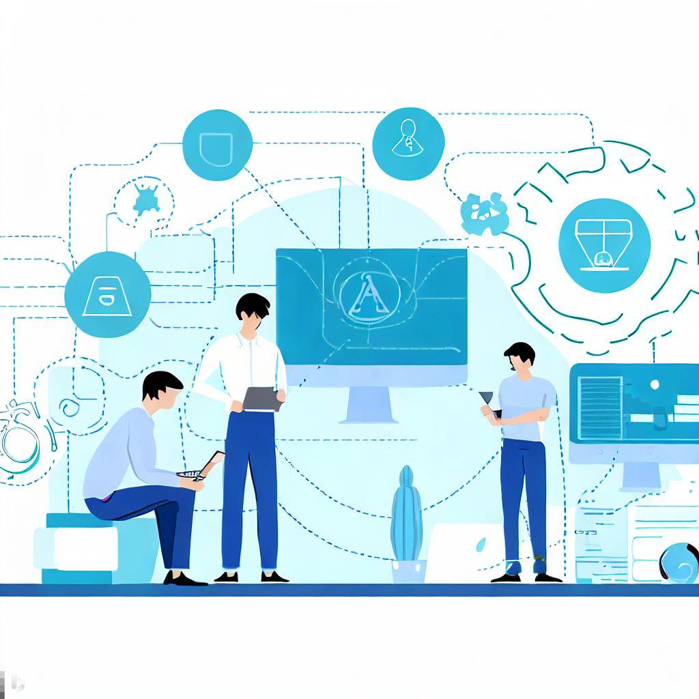
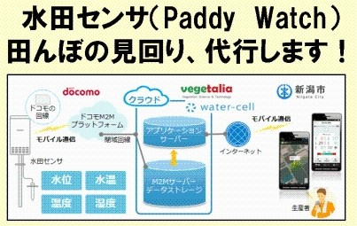
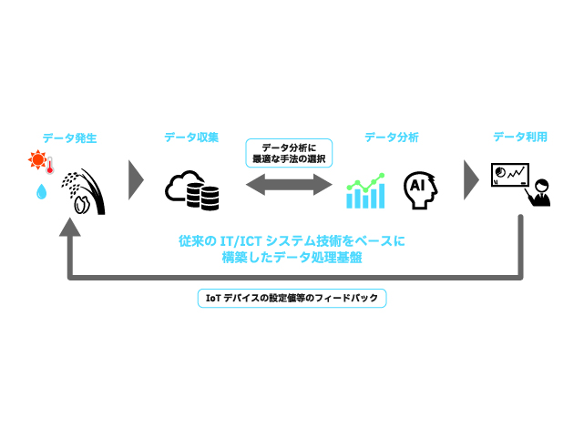

author: Comfort Desing Lab
summary: IoTとは
id: codelab-IoT-Learning
categories: IoT
environments: Web
status: Draft
feedback link: https://github.com/comfortdesignlab/steam-workshop-contents

# IoT Learning Contents

## 全体概要
Duration: 00:00:00

スマートシティで利用されているデジタル技術を理解しよう💡

IoTの概要から基礎・活用までを、活用されている事例を踏まえて紹介していきます。
スマートシティの実現による未来の社会を考えてみましょう！

### **目次**
1. 全体概要
1. IoTとは
1. IoTで実現できること
1. 活用事例の紹介
1. データを集める
1. IoTプラットフォーム
1. データ分析手法
1. 参考文献

### **得られること**
- IoTに関する基本知識
- データの利活用に関する基本知識
- 未来の社会を考える社会的スキル

### **必要なモノ**
- インターネットに接続可能なPC または タブレット

## IoTとは
Duration: 00:05:00

ここではIoTの概念について紹介します。

####  **IoTとは**
IoTとは **Internet of Things** の略で、**「モノのインターネット」** と訳されています。
身の回りのさまざまなモノが、インターネットを通じて互いに情報をやり取りする仕組みを指します。

異なるモノやデバイスがインターネットを通じてデータを収集・送信し、相互に情報をやり取りすることにより、日常生活や産業、都市などの様々な領域で、物体同士や物体と人とのコミュニケーションが実現されます。

#### **例えば...**
家の中の冷蔵庫や照明、スマートフォン、自動車などが互いにデータを送受信し、連携することで便利な機能やサービスを提供することができます。

1. **スマートホーム**  
IoTを活用すると、スマートホームが実現できます。温度調整システムは、外出先からでも家の温度を調節できるようになります。センサーが部屋の状態をモニターし、適切な温度を保つように調整してくれます。

1. **健康モニタリング**  
IoTデバイスは健康管理にも役立ちます。心拍数や歩数を計測するウェアラブルデバイスは、日々の健康状態を把握しやすくしてくれます。医師との連携もしやすくなります。

1. **交通システム**  
スマートな交通システムもIoTの一例です。信号機や道路センサーがリアルタイムの交通情報を集め、渋滞回避のための経路案内を提供します。

## IoTで実現できること
Duration: 00:05:00

ここではIoTで実現できることを紹介します。

#### 実現できること
IoTで実現できることは大きく分けて3つあります。
- IoTで**モノを操作**する
- IoTで**モノの状態を把握**する
- IoTで**モノ同士が通信**する

#### **IoTでモノを操作する**
IoT技術を活用すれば、インターネットを通じて離れた場所にあるモノを操作することができます。例えば、スマートフォンでの家電製品の操作や照明のON/OFFなどです。また工場などでも幅広く活用されており、外から工場の設備を動かす、現場に行かずに機器のメンテナンスを行う、といったことが実現できます。

#### **IoTでモノの状態を把握する**
センサで取得した情報をインターネット経由で受信することで、離れた場所にあるモノの状態を把握することができます。例えば、部屋の環境を知る、モノの動きを検知する、モノの現在位置を知る、モノの使用状況を知る、といった状態を知ることができます。先ほど紹介したモノを操作する機能と組み合わせれば、設備の異常な動きをリアルタイムに把握して、遠隔ですばやくメンテナンス対応することも可能です。

#### **IoTでモノ同士が通信する**
IoT技術では、インターネットを通じてモノ同士が通信することができます。人が介在しなくてもモノ同士が情報を交換し自動で動作してくれます。そのため、自動化を実現する上では欠かせない技術です。例えば、現在注目を集めている自動運転技術では、ほかの車や道路のさまざまな機器と通信して周辺状況を把握しつつ走行する技術が開発されています。

#### **IoTにおける５つのステップ**

これらの機能を実現するために、IoTは5つのステップを行なっています。

1. **計測**  
モノや環境からデータを収集するため、センサやデバイスが使用されています。これには温度センサ、湿度センサ、動きセンサなど様々な種類のセンサが含まれています。これらのセンサは、実世界の情報をデジタルデータに変換しています。

1. **収集**  
センサやデバイスが収集したデータは、インターネットを介して送信されています。無線通信や有線通信など、さまざまな方法でデータがオンラインにアップロードされています。

1. **蓄積**  
収集されたデータは、インターネット上のサーバーやデータベースに保存されています。ここでデータは整理・管理され、必要なときにアクセスできるようになります。

1. **解析**  
蓄積されたデータを利用して、解析や処理が行われます。データの分析を行うことで、データからパターンや特徴を見つけ出しています。

1. **活用**  
解析で得られた結果を基に、適切なアクションを起こし活用していきます。例えば、スマートホームで室温が高い場合にエアコンが自動的に作動する、交通システムで渋滞が予測された場合に別ルートが提案されるなどがあります。

## 活用事例の紹介
Duration: 00:05:00

ここではIoT技術の活用事例を紹介します。

#### **雪による交通の乱れの解決**

　北海道札幌市では、冬季雪が多いい地域です。そのため除雪した路肩の雪山や、路面のわだち等による渋滞の発生、交通機関運航の乱れが発生しています。
 
　これを解決するため、ごみ収集車やパトロールカーにセンサーを取り付け路面情報の収集を行いました。ほかにも、バスやタクシーのGPS、加速度センサーから交通情報、位置情報を、静的データとして気象情報、徐排雪実施記録データなどの沢山のデータを収集しました。これら集まったデータから路肩の積雪や路面状況を原因とした渋滞が発生しやすい区間の特定を行い、この区間でのスポット的な除排雪の実施を行いました。また、これら収集したデータはオープンデータに適した形に加工、変換を行い「札幌市ICT活用プラットフォーム」でデータを公開しており、行政サービスの見える化、大学などの研究に役立っています。
 
　このようにして札幌市では、様々なセンサーなどのIoTを活用することによ多くのデータを収集活用し、街の防災に役立てています。

一般財団法人さっぽろ産業復興財団　[「冬季プローブカーデータの収集・提供およびスマート除雪サービス」](https://www.soumu.go.jp/main_content/000563022.pdf) より引用

#### **保育施設の課題解決**
　保育施設において毎年事故が発生おり、特にお昼寝の時間にはリスクが高くなります。東京都豊島区では以前から保育施設でのお昼寝時間における保育士たちの物理的、精神的負担が大きいと考えていました。
 
　これを解決するため、お昼寝時の園児の様子を見守ることができるシステムを区立の保育園へ導入しました。このシステムでは、園児の肌着等に午睡センサーを取り付けます。このセンサーで体動を感知することができ、園児の向きを専用のアプリへ送り、チェック表へ自動で記録を取ります。さらに保育士が目視チェックを行います。
 
　これにより、保育士の負担が減らされるだけでなく、事故の発生率も減らすことができます。

**実際に使われているセンサー「シエスタBeBeS」**

グローバル電子株式会社　[ベビーセンサー「シエスタべべ」｜保育園向け午睡チェックセンサー](https://siesta.gec-tokyo.co.jp/) より引用

#### **水田管理の課題解決**
　新潟県新潟市では、農業経営体数の減少や１経営体あたりの管理面積の増加、これによる、栽培管理時間の増加などが課題でした。これを解決するため、新潟市ではNTTドコモ、ベジタリア、ウォーターセルで連携協定を締結し、IoT/ICT技術を活用した田んぼの見回りしシステムの導入を行っています。
 
　水田では簡易気象計で気温、湿度、風向き、風速、降雨量、照度を、水田センサでは、水位、水温、土壌温度を計測しています。これらのデータを分析することにより米の生育管理の手助けを行っています。また、農薬の散布ではドローンの使用を、刈り取りの際にはICTコンバインを利用しています。ICTコンバインでは収穫した籾（もみ）の収穫量や水分量を測定し収穫成績をわかりやすくし、栽培履歴と照らし合わせることで来年の栽培計画にも役立てることができるようになっています。また、これらデータはスマホを利用し、作業員間で共有・閲覧が可能となっています。
 
　これら取り組みにより、田んぼの見回り作業等における、時間と労力の削減を実現しました。

総務省　[センサ利活用による水田管理｜ICT地域活性化ポータル](https://www.soumu.go.jp/main_sosiki/joho_tsusin/top/local_support/ict/jirei/2017_037.html) より引用

## IoTデータの活用
Duration: 00:05:00

ここではIoTデータの活用について紹介します。

#### **IoTシステムにおけるデータの流れ**
IoTシステムを活用する際には、**「収集したデータをどのように分析し活用するのか」** を考えることが大切です。
IoTで扱うデータの基本的なライフサイクルは、データの発生、収集、蓄積、整形、集約、分析、利用のフェーズにより成り立ちます。また、分析結果をIoTデバイスにフィードバックして活用する場合もあります。

#### **IoTデバイスで収集可能なデータの種類**
IoTデバイスは、私たちの日常生活から様々なデータを収集します。
例えば、気温、湿度、位置情報、人の行動パターンなどがその一例です。
他にも基幹系の業務システムや、情報システムから抽出される情報、あるいはそれらのシステムの操作によって発生した情報など、オープンデータのようなWeb上のデータだけでなく、様々なデバイス、センサからリアルタイムに発生する計測データなどがあります。

**収集可能なデータの例**
- マルチメディアデータ
- ウェブサイトデータ
- センサデータ
- オペレーションデータ
- ログデータ
- オフィスデータ
- カスタマーデータ
- ソーシャルメディアデータ

**ビックデータとは:**  
人間では全体を把握することが困難な巨大なデータ群のことです。
明確な定義は存在しませんが、一般的にはVolume（量）、Variety（種類）、Velocity（速度あるいは頻度）の **「3つのV」** を高いレベルで備えていることが特徴とされています。

|                  | ビッグデータの3つの特徴                                                                            | 
| ---------------- | -------------------------------------------------------------------------------------------------- | 
| Volume（量）     | 膨大な容量を持つ（数テラバイト〜数ペタバイト）                                                     | 
| Variety（種類）  | 列と行によって表現されるデータだけでなく、テキスト、音声、画像、動画、位置情報など多様な種類がある | 
| Velocity（速度） | 発生速度や頻度が高く、その処理にもスピードが求められる                                             | 

※画像に置き換える予定です

#### **IoTデータの特徴**
IoTシステムは、このような様々なデータをリアルタイムに使用、もしくは蓄積して活用するなど、**「可視化」「予測/分析」「通知/制御」** といった活用により高い価値を創出します。

IoTでは様々なデータを取り扱いますが、一般的にIoTデータの特徴として、次の事項が挙げられます。

- データは継続的に発生する
- 多種多様なデバイスやセンサから発生するデータが含まれる
- データの発生元となるのは、様々なメーカが作ったデバイス、センサ、その他の機器であ るため、規格、データフォーマット、通信プロトコルなどを合わせる必要あり
- 規格、データフォーマット、通信プロトコルが変化、変更になる可能性がある
- 多くのデバイス、センサから継続してデータが収集されるので、業務システムに比べ爆発的にデータが増えることになる
- データにノイズ(本来は必要としない付帯情報)が多く含まれている場合がある
- デバイスやセンサが持つ内部時刻のズレにより、時間についての誤差が発生する場合がある

## IoTプラットフォーム
Duration: 00:05:00

ここではIoTプラットフォームについて紹介します。

#### **IoTプラットフォームとは**
IoTプラットフォームは、IoTデバイスの接続、データの収集・解析、アプリケーションの開発など、IoTシステムを構築・管理するための基盤のことです。
これにより、異なるデバイスやアプリケーションが協調して動作し、データを共有・利用することができるようになります。

#### **IoTプラットフォームが備える基本機能**
1. **IoTデバイス接続と管理**  
IoTプラットフォームは、さまざまなデバイスやセンサーをインターネットに接続するためのツールを提供しています。
これにより、デバイスの登録、監視、遠隔制御などが可能になります。

1. **データ収集とストレージ**  
プラットフォームはデバイスからのデータを収集し、クラウド上のデータベースに格納しています。
ここでデータは整理・保管されることで、データの取得や解析を行えるようになります。

1. **データ解析と処理**  
IoTプラットフォームは、データ解析ツールを提供し、データから有効な情報を抽出する手助けをしています。
例えば、データのパターン、トレンド、異常値などを検出し、意味のある情報を生成しています。

1. **アプリケーション開発**  
IoTプラットフォームは、データを利用してアプリケーションを開発するためのツールやAPIを提供しています。
アプリケーションの開発者はこれを使用して、新しいサービスや機能を作成することができます。

- API（Application Programming Interface）とは：
 
ソフトウェアやアプリケーション同士が情報をやり取りするための技術のことです。
これを通じて、それぞれのソフトウェアはプラットフォームと連携し、データや機能を共有することができるようになります。

5. **セキュリティと認証**  
IoTプラットフォームは、データのセキュリティを保護するための仕組みを提供しています。
データの暗号化、アクセス制御、認証などが含まれます。

#### **オープンデータの活用**
多くの企業やプロバイダーが独自のIoTプラットフォームを提供しており、さまざまな用途に合わせたカスタマイズが可能です。また、オープンソースのIoTプラットフォームも存在し、開発者や企業が自由に活用できるプラットフォームもあります。

**プラットフォームの例**
1. **SORACOM**  
SORACOMは、IoT に特化したLTE/3Gモバイルデータ通信と、データを便利に、安全にお客様のシステムまで送り届ける付加サービスを提供するプラットフォームです。
また、SORACOMでは、パケット交換、帯域制御、顧客管理、課金管理といった機能を、クラウド上にソフトウェアで構築し、ユーザーコンソールもしくは、API で提供しています。
SORACOMプラットフォームは、大量のモノとつながる、IoTに必要な通信を提供することができます。

- サイトリンク:[SORACOM](https://soracom.jp/)

2. **RESAS**  
地域経済分析システム（RESAS：リーサス）は、地方創生の様々な取り組みを情報面から支援するために、経済産業省と内閣官房デジタル田園都市国家構想実現会議事務局が提供しています。
自治体職員の方や、地域の活性化に関心を持つ様々な分野の方によって、効果的な施策の立案・実行・検証のためなどに広く利用されています。

- サイトリンク：[RESAS](https://resas.go.jp/)

3. **データプラットフォームくれ**  
広島県呉市では、データを公開することにより、地域課題解決やイノベーション創発を促す取り組みである「データプラットフォームくれ」事業に取り組んでいます。本事業により提供されるデータの利用方法について紹介し、多くの方が呉市のデータを利活用いただくことを目的としています。

- サイトリンク：[データプラットフォームくれ](https://www.expolis.cloud/guides/opendata/t/kure/)

## データ分析手法
Duration: 00:05:00

ここではデータ分析手法について紹介します。

#### **統計処理と機械学習**
データ解析には大きく分けて **統計処理** と **機械学習** の2つがあります。

**統計処理**  
統計処理は、データの特性やパターンを数値的に分析する方法です。
データから得られる情報を整理し、要約し、解釈するために広く使用されます。
分析結果の因果関係を人間が理解しやすい、**原理原則を探求する学術的手法** です。

- 予測  
過去のデータをもとに未来の出来事や値を推測することができます。
既知のデータのパターンや関係性を分析し、その情報をもとに未知のデータを予測します。
データの関係を調べる代表的な方法として、**相関分析** や **回帰分析** が挙げられます。

- 分類  
データの傾向や特徴ごとにデータを仕分けることができます。
与えられたデータを既知のカテゴリに分類することでデータのパターンを把握します。
代表的な分類手法として、**主成分分析** や **クラスター分析** が挙げられます。

**機械学習**  
機械学習（Machine Learning）は、コンピュータにデータから学習させて、経験から知識を獲得して問題を解決する手法です。
データをもとにパターンやルールを学習し、その学習結果をもとに予測や判断を行う能力をコンピュータに与える方法です。
既知のデータから未知のデータを予測することを主な目的としており、機械学習は **実用性を重視したビジネス寄りの手法**  です。

- 教師あり学習  
既知のデータ（ラベル付きデータ）をもとにモデルを学習させる手法です。
例えば、写真に表示された猫の画像が猫であるかを識別する場合には、ラベル付きの猫画像と非猫画像を使用して学習します。

- 教師なし学習  
ラベルが付いていないデータを解析して、パターンや構造を発見する手法です。
例えば、顧客の購買履歴から特定のグループを自動的に識別する場合があります。

#### **IoTとAI**
AIとは、コンピュータがデータから学習し自動的に意思決定を行える能力を指します。
AIは大量のデータを分析し、パターンや関連性を発見し、予測や判断を行うことができます。

IoTで収集されるデータが、AIの学習と分析に活用されることで、新たな洞察や価値が生まれます。
IoTが提供するビッグデータは、AIの能力を引き出すための重要な情報源となり、私たちの生活やビジネスの向上に大いに寄与することが期待できます。
次の講義では、これらの概念を深く理解し、AIとビッグデータの具体的な応用について詳しく学びましょう。

## IoTアプリケーション
Duration: 00:05:00

ここではIoTアプリケーションについて紹介します。

#### **IoTアプリケーションとは**
IoTアプリケーションは、物理的なデバイスやセンサー、ソフトウェア、およびその他の技術を組み合わせて、データを収集・交換するシステムを指します。これらのデバイスはインターネットを通じて接続され、リモートで制御や分析が可能です。

※何かイメージ画像を挿入予定です

#### **IoTの主な特徴**
1. **接続性**  
IoTデバイスは常にネットワークに接続されているため、リアルタイムでのデータ交換やリモート制御が可能です。

1. **自動化**  
センサーやアルゴリズムを使用して、特定の条件下で自動的に動作することができます。

1. **データ収集**  
多種多様なセンサーからのデータを収集し、クラウドやローカルのデータベースに保存することができます。

1. **リモートモニタリング**  
ユーザーはスマートフォンやコンピューターを使用して、デバイスの状態や動作をリアルタイムで確認することができます。

#### **IoTアプリケーションの例**
1. **スマートホーム**  
スマートサーモスタットや照明、セキュリティカメラなど、家庭内のデバイスをリモートで制御することができます。

1. **ウェアラブルデバイス**  
スマートウォッチやフィットネストラッカーがこれに該当し、ユーザーの健康や活動をリアルタイムでモニタリングします。

1. **スマートシティ**  
交通管理、ゴミ収集、公共照明など、都市のインフラを最適化するためのIoTアプリケーション。

1. **産業IoT（IIoT）**  
工場や製造施設での機械のモニタリングやメンテナンス、生産ラインの最適化など。

1. **農業**  
土壌の湿度や気温をモニタリングして、最適な水や肥料の供給を自動化します。

1. **医療**  
患者の健康状態をリモートでモニタリングするデバイスや、医薬品の在庫管理など。

これらはIoTの実例の一部に過ぎません。IoT技術は急速に進化しており、さまざまな分野で新しいアプリケーションが開発されています。皆さんもアイデアの創出、プロトタイプ開発ができるように学習していきましょう！

## 参考文献
Duration: 00:05:00

1. モバイルコンピューティング推進コンソーシアム監修　『IoT技術テキスト　ーMCPC IoTシステム技術検定 対応ー』 RIC 2016.10.28 

1. 活用事例１

1. 活用事例２

1. 活用事例３

